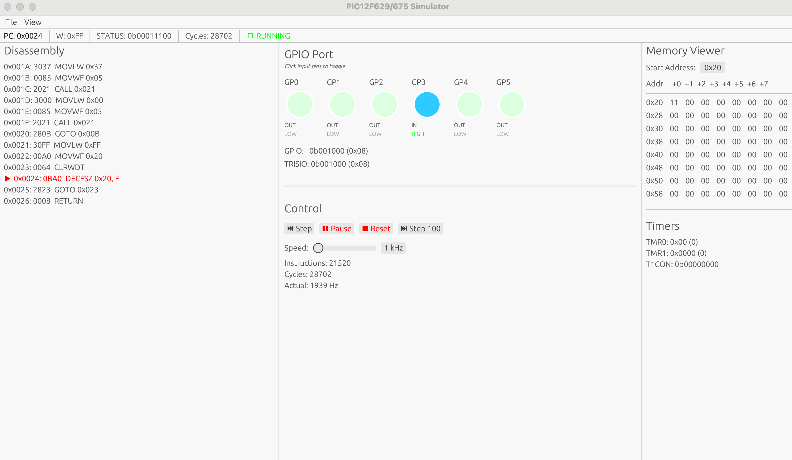
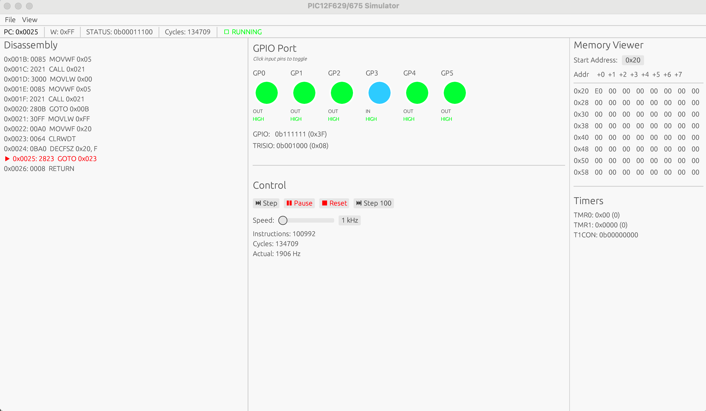

# PIC12F629/675 Simulator

A PIC12F629/675 microcontroller simulator written in Rust.

## About

This simulator implements the PIC12F629/675 8-bit microcontroller architecture based on the official Microchip datasheet:
- **Reference**: [PIC12F629/675 Data Sheet (DS41190G)](https://ww1.microchip.com/downloads/aemDocuments/documents/MCU08/ProductDocuments/DataSheets/41190G.pdf)
- **Purpose**: Educational tool for learning microcontroller architecture and embedded systems
- **Accuracy**: Cycle-accurate instruction execution with faithful register and peripheral emulation

## Project Structure

```
pic_simulator/
├── src/
│   ├── lib.rs              # Library entry point — defines public modules and exports simulator APIs
│   ├── main.rs             # CLI entry point — launches the interactive simulator shell
│   │
│   ├── memory.rs           # Memory subsystem: implements program memory (14-bit), data RAM, EEPROM, stack
│   ├── cpu.rs              # CPU core: W register, PC, STATUS flags, and ALU arithmetic/logic
│   ├── instruction.rs      # Instruction decoder: parses 14-bit opcodes into structured enums
│   ├── executor.rs         # Instruction executor: defines behavior for all 35 PIC instructions
│   ├── gpio.rs             # GPIO controller: models GP0–GP5 pins, TRISIO, and I/O states
│   ├── timer.rs            # Timer subsystem: implements Timer0/Timer1, prescaler, and overflow logic
│   ├── interrupt.rs        # Interrupt controller: manages interrupt vectors, enable flags, ISR entry/exit
│   ├── wdt.rs              # Watchdog Timer: simulates WDT countdown, CLRWDT, and reset-on-timeout
│   ├── simulator.rs        # Main simulator engine: integrates CPU, memory, peripherals, and runtime loop
│   ├── debugger.rs         # Debug utilities: disassembler, register inspector, and execution tracer
│   ├── hexloader.rs        # Intel HEX loader: parses and loads .hex firmware into simulated memory
│   ├── cli.rs              # Command-line interface: interactive REPL for simulation and inspection
│   │
│   └── gui/                # Graphical user interface (Egui/Eframe-based)
│       ├── mod.rs          # GUI module entry — re-exports the app
│       └── app.rs          # GUI application — interactive simulator window with GPIO/timer visualizations
│
├── examples/
│   ├── gpio_demo.rs        # Demonstrates GPIO operations (pin toggle, LED blink simulation)
│   ├── timer_demo.rs       # Demonstrates Timer0/Timer1 operation and overflow handling
│   ├── interrupt_demo.rs   # Demonstrates interrupt handling and ISR flow control
│   ├── sleep_wdt_demo.rs   # Demonstrates SLEEP instruction and Watchdog Timer wake-up/reset
│   └── hexloader_demo.rs   # Demonstrates Intel HEX loading, disassembly, and simulation of a small program
│
└── Cargo.toml              # Project manifest: dependencies, metadata, and example configurations
```

## Screenshots

### GUI Interface

*Interactive simulator with real-time GPIO visualization and disassembly view*


*LED blink pattern running from loaded HEX file*

## Implemented Features

### ✅ Core Features
- **CPU**: 8-bit RISC architecture, 35 instructions
- **Memory**: 1KB program memory, 64 bytes RAM, 128 bytes EEPROM
- **Stack**: 8-level hardware stack

### ✅ Instruction Set
All 35 instructions implemented, including:
- Data operations: `MOVWF`, `MOVF`, `ADDWF`, `SUBWF`, `ANDWF`, `IORWF`, `XORWF`
- Bit operations: `BSF`, `BCF`, `BTFSC`, `BTFSS`
- Immediate values: `MOVLW`, `ADDLW`, `SUBLW`, `ANDLW`, `IORLW`, `XORLW`
- Control flow: `GOTO`, `CALL`, `RETURN`, `RETFIE`, `RETLW`
- Others: `NOP`, `CLRW`, `CLRF`, `SWAPF`, `COMF`, `INCF`, `DECF`, `RLF`, `RRF`

### ✅ GPIO
- 6-bit bidirectional port (GP0-GP5)
- Direction control (TRISIO)
- Weak pull-up resistors (WPU)
- GP3 fixed as input
- External pin simulation

### ✅ Timers
- **Timer0**: 8-bit timer with configurable prescaler (1:2 to 1:256)
- **Timer1**: 16-bit timer with configurable prescaler (1:1 to 1:8)
- Overflow interrupt support

### ✅ Interrupt System
- Global interrupt enable (GIE)
- Timer0 overflow interrupt
- Timer1 overflow interrupt
- GPIO change interrupt
- External interrupt (INT)
- Interrupt vector (0x0004)
- `RETFIE` instruction support

### ✅ Tools
- Intel HEX file loader
- Interactive debugger
- Disassembler
- Breakpoint support
- Single-step execution

## Quick Start

### Build
```bash
cargo build --release
```

### Run Interactive CLI
```bash
cargo run
```

### Run Graphical Simulator (GUI)
```bash
cargo run -- --gui
```

## Testing with HEX Files

### Compile Test Program
The project includes a test assembly program (`test.asm`) that demonstrates LED patterns.

**On macOS:**
```bash
# Install GPUTILS
brew install gputils

# Compile the test program
gpasm -p p12f629 test.asm

# This generates test.hex
```

**On Linux:**
```bash
sudo apt-get install gputils
gpasm -p p12f629 test.asm
```

**On Windows:**
Use MPLAB X IDE or download GPUTILS for Windows.

### Load and Run
```bash
# Start GUI
cargo run -- --gui

# In GUI:
# 1. File -> Load HEX File -> Select test.hex
# 2. Click "Run" button
# 3. Observe LED pattern: GP0→GP1→GP2→GP4→GP5→All On→All Off (loop)
```

### Expected Behavior
✅ LED indicators should light up in sequence  
✅ Pattern cycles continuously  
✅ GP3 remains off (hardware limitation - input only)  
✅ Disassembly view shows current instruction with red arrow

### Basic Commands
```
load <hex_file>     - Load HEX file
step [n]            - Execute n instructions (default: 1)
run [addr]          - Run program from address
break <addr>        - Set breakpoint
reg                 - Display registers
mem <addr> [count]  - Display memory
disasm <addr> [n]   - Disassemble instructions
gpio                - Display GPIO state
timer               - Display timer status
int                 - Display interrupt status
reset               - Reset simulator
quit                - Exit
```

## Run Examples

### GPIO Demo
```bash
cargo run --example gpio_demo
```

### Timer Demo
```bash
cargo run --example timer_demo
```

### Interrupt Demo
```bash
cargo run --example interrupt_demo
```

## Manual Programming Example

```
pic> load 0x3001 0x0085 0x1405
Loaded 3 instructions

pic> disasm 0 3

Disassembly:
Addr   Hex    Assembly
------ ------ ----------------
> 0x0000 0x3001 MOVLW 0x01
  0x0001 0x0085 MOVWF 0x05
  0x0002 0x1405 BSF 0x05, 0

pic> step 3
0x0000: MOVLW 0x01 (1 cycles)
0x0001: MOVWF 0x05 (1 cycles)
0x0002: BSF 0x05, 0 (1 cycles)

PC = 0x0003, W = 0x01, Cycles = 3

pic> gpio

GPIO Port State:
┌────┬────┬────┬────┬────┬────┐
│GP5 │GP4 │GP3 │GP2 │GP1 │GP0 │
├────┼────┼────┼────┼────┼────┤
│ -  │ -  │ -  │ -  │ -  │ ●  │
│ IN │ IN │ IN │ IN │ IN │OUT │
└────┴────┴────┴────┴────┴────┘
```

## Testing

```bash
cargo test
```

## Tech Stack

- **Language**: Rust
- **Dependencies**: Pure standard library core; GUI layer additionally uses eframe/egui.

## License

MIT

---

**Note**: This is an educational/learning project for understanding microcontroller architecture and simulator design.